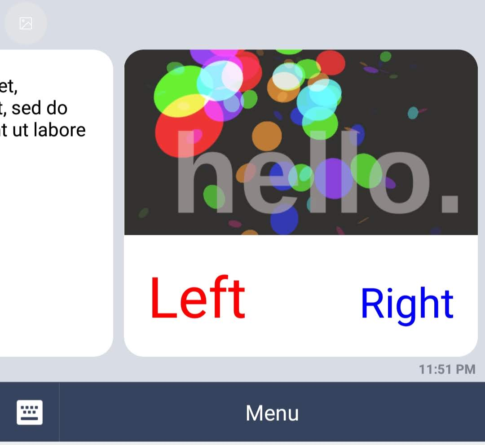

# react-line-renderer

Create LINE Flex Messages using JSX.

```js
<FlexMessage altText="Lorem ipsum!">
  <Carousel>
    <Bubble>
      <Box layout="vertical">
        <Text wrap>
          Lorem ipsum dolor sit amet, consectetur adipiscing elit, sed do
          eiusmod tempor incididunt ut labore et dolore magna aliqua.
        </Text>
      </Box>
    </Bubble>
    <Bubble
      hero={
        <Image
          url="https://i.imgur.com/mFHkiNw.png"
          size="full"
          aspectRatio="1.91:1"
        />
      }
    >
      <Box layout="baseline">
        <Text wrap flex={1} size="4xl" color="#ff0000">
          Left
        </Text>
        <Text wrap flex={1} size="3xl" color="#0000ff" align="end">
          Right
        </Text>
      </Box>
    </Bubble>
  </Carousel>
</FlexMessage>
```


